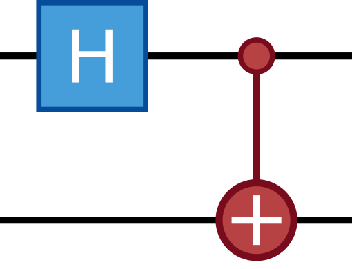

    

    
    
    

---

# Welcome to HEOM

**Authors: [Kiyoto Nakamura, Dennis Herb](https://github.com/dehe1011)**

## References

Papers from our group:

* [K. Nakamura and J. Ankerhold, A quantum physics layer of epigenetics: a hypothesis deduced from charge transfer and chirality-induced spin selectivity of DNA. *Phys. Rev. Research 6(3)*, 033215 (2024).](https://doi.org/10.1103/PhysRevResearch.6.033215)

## Support

For support, please contact the author at dennis.herb@uni-ulm.de.
