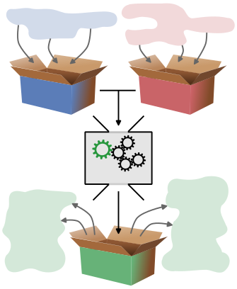
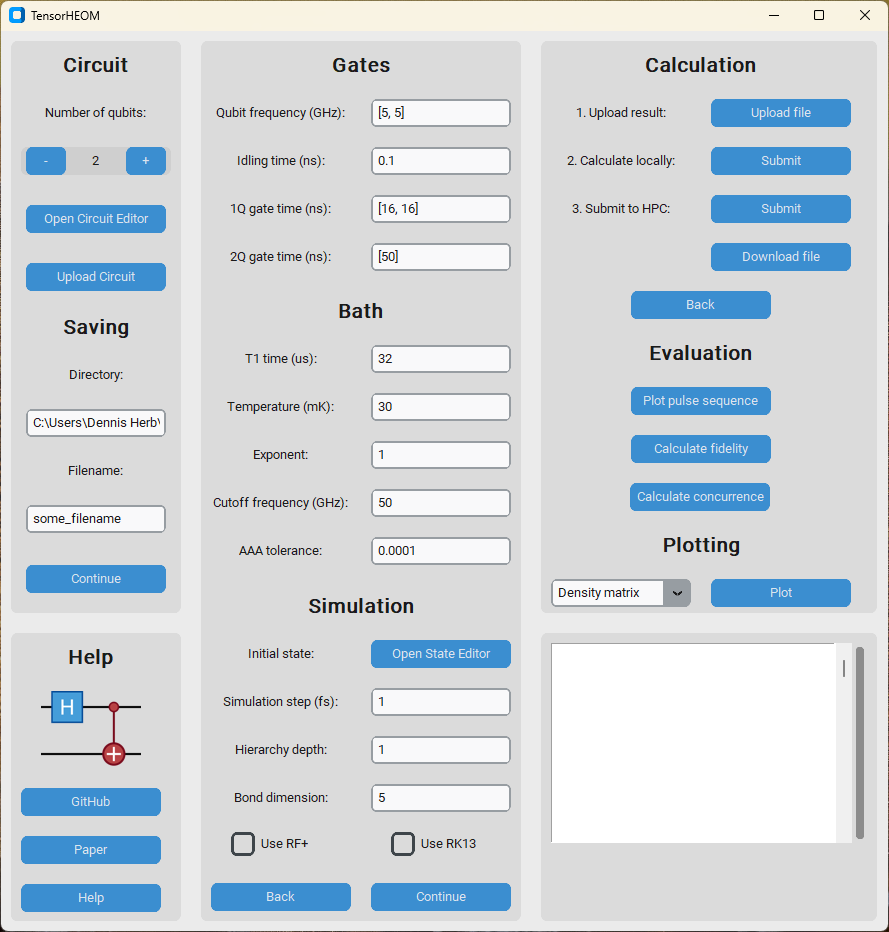

    

    
    
    

---

# Welcome to HEOM

**Authors: [Kiyoto Nakamura, Dennis Herb](https://github.com/dehe1011)**

    

    

## References

Recent papers from our group:

* [K. Nakamura and J. Ankerhold, Impact of time-retarded noise on dynamical decoupling schemes for qubits. *Physical Review B 6(111)*, 064503 (2025).](https://doi.org/10.1103/PhysRevB.111.064503)
* [K. Nakamura and J. Ankerhold, Entanglement dynamics and performance of two-qubit gates for superconducting qubits under non-Markovian effects. *arxiv:2510.05872* (2025).](http://arxiv.org/abs/2510.05872)

## Support

For support, please contact the author at dennis.herb@uni-ulm.de.
