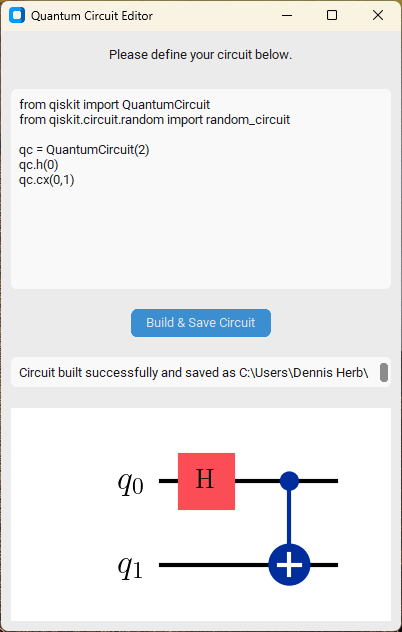
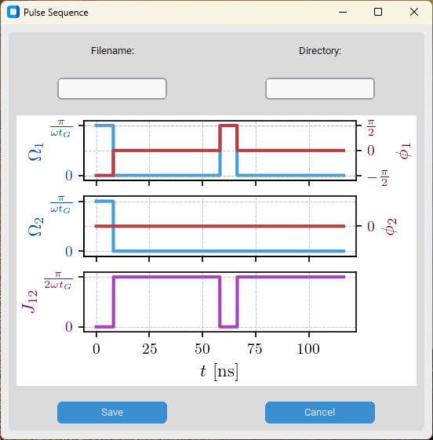

.. _guidoc:

*******************************
Graphical User Interface (GUI)
*******************************

TensorHEOM provides an optional graphical user interface built with
`CustomTkinter <https://github.com/TomSchimansky/CustomTkinter>`_.
The GUI is designed for users who prefer an interactive, form-based workflow
without writing code.

Launching the GUI
=================

.. code-block:: python

   from ttheom import TensorHeomApp

   TensorHeomApp().mainloop()

Or from the command line after installing the package:

.. code-block:: bash

   python -c "from ttheom import TensorHeomApp; TensorHeomApp().mainloop()"

Main window
===========

The main window provides input fields for all simulation parameters:
qubit frequencies, initial state, bath parameters, numerical settings, and the
output file name.

.. figure:: ../figures/GUI1.png
   :align: center
   :width: 5in

   Main window showing system, bath, and simulation parameter fields.

Quantum circuit editor
======================

The circuit editor window integrates with Qiskit to let you build and visualise
quantum circuits graphically.  Gates can be added via drop-down menus and the
resulting Qiskit circuit is passed directly to the simulation engine.

   Quantum circuit editor with Qiskit circuit visualization.

Results viewer
==============

Once a simulation completes, the results viewer displays the time-evolved
reduced density matrix elements and derived quantities such as concurrence.

   Results viewer showing the concurrence as a function of time.
