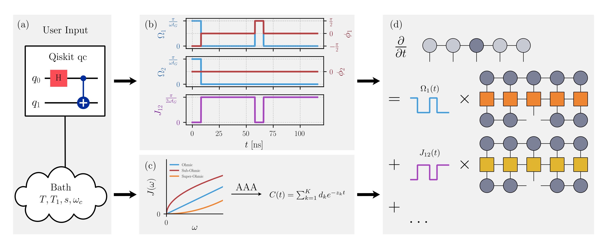

Welcome to TensorHEOM's Documentation!
======================================

TensorHEOM is an open-source python package.

Whether you're a scientist, student, or just curious, dive in and start exploring!

About This Documentation
------------------------
This documentation includes:

- **API Reference**: Description of functions and classes.
- **User Guide**: Tutorial Jupyter notebooks for getting started.
- **Graphical User Interface (GUI)**: Information on how to use the GUI.

For additional resources and development information, visit the `TensorHEOM GitHub repository <https://github.com/dehe1011/TensorHEOM>`_. 

.. toctree::
   :maxdepth: 2
   :caption: Contents:

   installation
   apidoc/apidoc
   guide/guide
   gui/gui
   biblio
   copyright

Indices and tables
==================

* :ref:`genindex`
* :ref:`modindex`
* :ref:`search`
